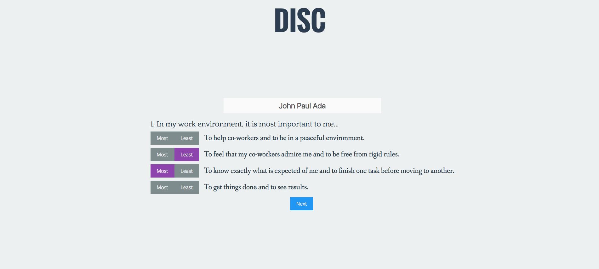
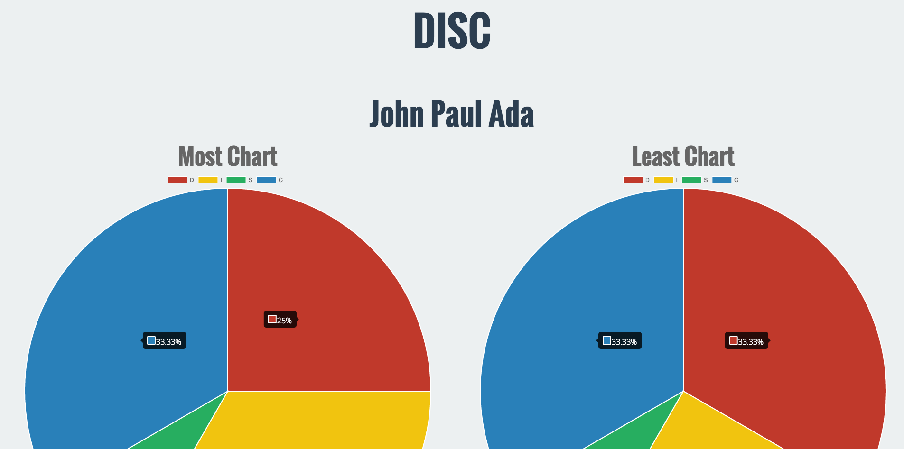

# DISC
Know your DISC personality traits to know how to relate to people better.

DISC stands for:

* [Dominant](https://www.discinsights.com/personality-style-d) - (Active, Task-Oriented)
* [Influential](https://www.discinsights.com/personality-style-i) - (Active, People-Oriented)
* [Steady](https://www.discinsights.com/personality-style-s) - (Passive, People-Oriented)
* [Conscientious](https://www.discinsights.com/personality-style-c) - (Passive, Task-Oriented)

## Screenshots:

